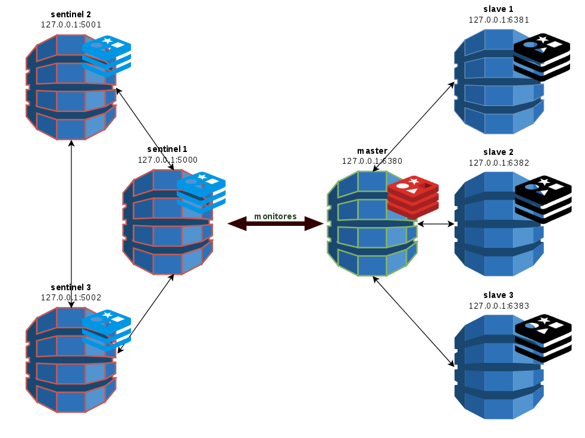

# Hight Availability on Redis with sentinel : step by step
<p align="center">
	<a href="#" >
	    
	</a>
</p>
If you didn't yet played with redis, then it is a good idea to do this and come back :
* [Redis quich start](quick_start)
* [master_slave_replication](master_slave_replication)

We assume that you have done the previous steps. We will use redis-server and redis-clis from any folder.

## Choose a folder from where to play with redis.
Here we choose redis_sentinel.
```shell
mkdir redis_sentinel && cd redis_sentinel
```

## Create a master-slave replication nodes as we done in the Master-slave replication section.
[Image architecture à mettre]
You should have 4 running instances : Master(6380), Slave1(6381), Slave2(6382), Slave3(6383).

## Configure sentinel nodes
[Image Architecture]
Here we will use three sentinels to monitor one master.

### sentinel 1
```shell
mkdir 5000
cat > 5000/sentinel.conf <<EOF
port 5000
sentinel monitor ha_master 127.0.0.1 6380 2
sentinel down-after-milliseconds ha_master 5000
sentinel parallel-syncs ha_master 1
sentinel failover-timeout ha_master 60000
EOF
```

### sentinel 2
```shell
mkdir 5001
cat > 5001/sentinel.conf <<EOF
port 5001
sentinel monitor ha_master 127.0.0.1 6380 2
sentinel down-after-milliseconds ha_master 5000
sentinel parallel-syncs ha_master 1
sentinel failover-timeout ha_master 60000
EOF
```

### sentinel 3
```shell
mkdir 5002
cat > 5002/sentinel.conf <<EOF
port 5002
sentinel monitor ha_master 127.0.0.1 6380 2
sentinel down-after-milliseconds ha_master 5000
sentinel parallel-syncs ha_master 1
sentinel failover-timeout ha_master 60000
EOF
```

### Configurations explanation
#### port
```shell
port 5002
```
The port where the sentinel node will listen for requests


#### sentinel monitor
```shell
sentinel monitor ha_master 127.0.0.1 6380 2
```
This options configure the default nodes group name `ha_master` the default master ip(`127.0.0.1`)  and portP(`6380`).
Since we have 3 nodes, we were requiring a quorum of 2 sentinels, allowing us to lose up to one machine. 
If we had a cluster of 5 machines, which would allow us to lose 2 machines while still maintaining a majority of nodes participating in quorum.

#### sentinel down-after-milliseconds
```shell
sentinel down-after-milliseconds ha_master 5000
```
For this example, a machine will have to be unresponsive for 5 seconds before being classified as down thus triggering a vote to elect a new master node.

#### sentinel parallel-syncs
```shell
sentinel failover-timeout ha_master 60000
```
Sets the number of slaves that can be reconfigured to use the new master after a failover at the same time, here 1.

#### sentinel failover-timeout
```shell
sentinel failover-timeout ha_master 60000
```


## Manualy start the instances
Type the following commands in separated shells
### sentinel 1
```shell
$redis-server 5000/sentinel.conf --sentinel
31497:X 03 Apr 15:34:37.736 # You requested maxclients of 10000 requiring at least 10032 max file descriptors.
31497:X 03 Apr 15:34:37.736 # Server can''t set maximum open files to 10032 because of OS error: Operation not permitted.
31497:X 03 Apr 15:34:37.736 # Current maximum open files is 4096. maxclients has been reduced to 4064 to compensate for low ulimit. If you need higher maxclients increase 'ulimit -n'.
                _._                                                  
           _.-``__ ''-._                                             
      _.-``    `.  `_.  ''-._           Redis 3.2.0 (00000000/0) 64 bit
  .-`` .-```.  ```\/    _.,_ ''-._                                   
 (    '      ,       .-`  | `,    )     Running in sentinel mode
 |`-._`-...-` __...-.``-._|'` _.-'|     Port: 5000
 |    `-._   `._    /     _.-'    |     PID: 31497
  `-._    `-._  `-./  _.-'    _.-'                                   
 |`-._`-._    `-.__.-'    _.-'_.-'|                                  
 |    `-._`-._        _.-'_.-'    |           http://redis.io        
  `-._    `-._`-.__.-'_.-'    _.-'                                   
 |`-._`-._    `-.__.-'    _.-'_.-'|                                  
 |    `-._`-._        _.-'_.-'    |                                  
  `-._    `-._`-.__.-'_.-'    _.-'                                   
      `-._    `-.__.-'    _.-'                                       
          `-._        _.-'                                           
              `-.__.-'                                               

31497:X 03 Apr 15:34:37.739 # WARNING: The TCP backlog setting of 511 cannot be enforced because /proc/sys/net/core/somaxconn is set to the lower value of 128.
31497:X 03 Apr 15:34:37.742 # Sentinel ID is b32f591ccbcf820ba113a7e1e428248de6ff8cdc
31497:X 03 Apr 15:34:37.742 # +monitor master ha_master 127.0.0.1 6380 quorum 2
31497:X 03 Apr 15:34:37.743 * +slave slave 127.0.0.1:6381 127.0.0.1 6381 @ ha_master 127.0.0.1 6380
31497:X 03 Apr 15:34:37.746 * +slave slave 127.0.0.1:6382 127.0.0.1 6382 @ ha_master 127.0.0.1 6380
31497:X 03 Apr 15:34:37.748 * +slave slave 127.0.0.1:6383 127.0.0.1 6383 @ ha_master 127.0.0.1 6380
31497:X 03 Apr 15:35:13.410 * +sentinel sentinel 5cf4f565f51af18d863b47389cc67ed98c015cfc 127.0.0.1 5001 @ ha_master 127.0.0.1 6380
31497:X 03 Apr 15:35:31.700 * +sentinel sentinel 74ac697c2f4a26bb67e1a143bb7261229e4bd784 127.0.0.1 5002 @ ha_master 127.0.0.1 6380

```

### sentinel 2
```shell
$redis-server 5001/sentinel.conf --sentinel
31632:X 03 Apr 15:35:11.348 # You requested maxclients of 10000 requiring at least 10032 max file descriptors.
31632:X 03 Apr 15:35:11.348 # Server can''t set maximum open files to 10032 because of OS error: Operation not permitted.
31632:X 03 Apr 15:35:11.348 # Current maximum open files is 4096. maxclients has been reduced to 4064 to compensate for low ulimit. If you need higher maxclients increase 'ulimit -n'.
                _._                                                  
           _.-``__ ''-._                                             
      _.-``    `.  `_.  ''-._           Redis 3.2.0 (00000000/0) 64 bit
  .-`` .-```.  ```\/    _.,_ ''-._                                   
 (    '      ,       .-`  | `,    )     Running in sentinel mode
 |`-._`-...-` __...-.``-._|'` _.-'|     Port: 5001
 |    `-._   `._    /     _.-'    |     PID: 31632
  `-._    `-._  `-./  _.-'    _.-'                                   
 |`-._`-._    `-.__.-'    _.-'_.-'|                                  
 |    `-._`-._        _.-'_.-'    |           http://redis.io        
  `-._    `-._`-.__.-'_.-'    _.-'                                   
 |`-._`-._    `-.__.-'    _.-'_.-'|                                  
 |    `-._`-._        _.-'_.-'    |                                  
  `-._    `-._`-.__.-'_.-'    _.-'                                   
      `-._    `-.__.-'    _.-'                                       
          `-._        _.-'                                           
              `-.__.-'                                               

31632:X 03 Apr 15:35:11.349 # WARNING: The TCP backlog setting of 511 cannot be enforced because /proc/sys/net/core/somaxconn is set to the lower value of 128.
31632:X 03 Apr 15:35:11.352 # Sentinel ID is 5cf4f565f51af18d863b47389cc67ed98c015cfc
31632:X 03 Apr 15:35:11.352 # +monitor master ha_master 127.0.0.1 6380 quorum 2
31632:X 03 Apr 15:35:11.353 * +slave slave 127.0.0.1:6381 127.0.0.1 6381 @ ha_master 127.0.0.1 6380
31632:X 03 Apr 15:35:11.355 * +slave slave 127.0.0.1:6382 127.0.0.1 6382 @ ha_master 127.0.0.1 6380
31632:X 03 Apr 15:35:11.358 * +slave slave 127.0.0.1:6383 127.0.0.1 6383 @ ha_master 127.0.0.1 6380
31632:X 03 Apr 15:35:12.274 * +sentinel sentinel b32f591ccbcf820ba113a7e1e428248de6ff8cdc 127.0.0.1 5000 @ ha_master 127.0.0.1 6380
31632:X 03 Apr 15:35:31.700 * +sentinel sentinel 74ac697c2f4a26bb67e1a143bb7261229e4bd784 127.0.0.1 5002 @ ha_master 127.0.0.1 6380
```

### sentinel 3
```shell
redis-server 5002/sentinel.conf --sentinel
31660:X 03 Apr 15:35:29.670 # You requested maxclients of 10000 requiring at least 10032 max file descriptors.
31660:X 03 Apr 15:35:29.670 # Server can''t set maximum open files to 10032 because of OS error: Operation not permitted.
31660:X 03 Apr 15:35:29.670 # Current maximum open files is 4096. maxclients has been reduced to 4064 to compensate for low ulimit. If you need higher maxclients increase 'ulimit -n'.
                _._                                                  
           _.-``__ ''-._                                             
      _.-``    `.  `_.  ''-._           Redis 3.2.0 (00000000/0) 64 bit
  .-`` .-```.  ```\/    _.,_ ''-._                                   
 (    '      ,       .-`  | `,    )     Running in sentinel mode
 |`-._`-...-` __...-.``-._|'` _.-'|     Port: 5002
 |    `-._   `._    /     _.-'    |     PID: 31660
  `-._    `-._  `-./  _.-'    _.-'                                   
 |`-._`-._    `-.__.-'    _.-'_.-'|                                  
 |    `-._`-._        _.-'_.-'    |           http://redis.io        
  `-._    `-._`-.__.-'_.-'    _.-'                                   
 |`-._`-._    `-.__.-'    _.-'_.-'|                                  
 |    `-._`-._        _.-'_.-'    |                                  
  `-._    `-._`-.__.-'_.-'    _.-'                                   
      `-._    `-.__.-'    _.-'                                       
          `-._        _.-'                                           
              `-.__.-'                                               

31660:X 03 Apr 15:35:29.671 # WARNING: The TCP backlog setting of 511 cannot be enforced because /proc/sys/net/core/somaxconn is set to the lower value of 128.
31660:X 03 Apr 15:35:29.673 # Sentinel ID is 74ac697c2f4a26bb67e1a143bb7261229e4bd784
31660:X 03 Apr 15:35:29.673 # +monitor master ha_master 127.0.0.1 6380 quorum 2
31660:X 03 Apr 15:35:29.674 * +slave slave 127.0.0.1:6381 127.0.0.1 6381 @ ha_master 127.0.0.1 6380
31660:X 03 Apr 15:35:29.676 * +slave slave 127.0.0.1:6382 127.0.0.1 6382 @ ha_master 127.0.0.1 6380
31660:X 03 Apr 15:35:29.679 * +slave slave 127.0.0.1:6383 127.0.0.1 6383 @ ha_master 127.0.0.1 6380
31660:X 03 Apr 15:35:29.791 * +sentinel sentinel 5cf4f565f51af18d863b47389cc67ed98c015cfc 127.0.0.1 5001 @ ha_master 127.0.0.1 6380
31660:X 03 Apr 15:35:30.638 * +sentinel sentinel b32f591ccbcf820ba113a7e1e428248de6ff8cdc 127.0.0.1 5000 @ ha_master 127.0.0.1 6380

```

## Start using automation script redis_sentinel.sh
Type the following commands after granting execution privileges to the scripts.
### Uncomment the following lines in redis_sentinel.sh if you did not launch redis instances using master_slave.sh
```shell
#./master_slave.sh init
#./master_slave.sh start

```
### Initialise sentinel configuration and start sentinel nodes
```shell
$ ./redis_sentinel.sh init
$ ./redis_sentinel.sh start

```

## Playing with sentinel

### Find the master node
```shell
$ redis-cli -p 5000 sentinel get-master-addr-by-name ha_master
1) "127.0.0.1"
2) "6380"

```

#### Asking Sentinel about the state of a master
```shell
$ redis-cli -p 5000 sentinel master ha_master
 1) "name"
 2) "ha_master"
 3) "ip"
 4) "127.0.0.1"
 5) "port"
 6) "6380"
 7) "runid"
 8) "06755f0eace2e324cbea7a49f14aeeda2b3265b2"
 9) "flags"
10) "master"
11) "link-pending-commands"
12) "0"
13) "link-refcount"
14) "1"
15) "last-ping-sent"
16) "0"
17) "last-ok-ping-reply"
18) "376"
19) "last-ping-reply"
20) "376"
21) "down-after-milliseconds"
22) "5000"
23) "info-refresh"
24) "3609"
25) "role-reported"
26) "master"
27) "role-reported-time"
28) "797161"
29) "config-epoch"
30) "0"
31) "num-slaves"
32) "3"
33) "num-other-sentinels"
34) "2"
35) "quorum"
36) "2"
37) "failover-timeout"
38) "60000"
39) "parallel-syncs"
40) "1"

```


### Display the slaves nodes of the ha_master group
```shell
$ redis-cli -p 5000 sentinel slaves ha_master
1)  1) "name"
    2) "127.0.0.1:6383"
    3) "ip"
    4) "127.0.0.1"
    5) "port"
    6) "6383"
    7) "runid"
    8) "3a92cac5ee83df63cdf15f173cd85efcc36298c8"
    9) "flags"
   10) "slave"
   11) "link-pending-commands"
   12) "0"
   13) "link-refcount"
   14) "1"
   15) "last-ping-sent"
   16) "0"
   17) "last-ok-ping-reply"
   18) "267"
   19) "last-ping-reply"
   20) "267"
   21) "down-after-milliseconds"
   22) "5000"
   23) "info-refresh"
   24) "1116"
   25) "role-reported"
   26) "slave"
   27) "role-reported-time"
   28) "935018"
   29) "master-link-down-time"
   30) "0"
   31) "master-link-status"
   32) "ok"
   33) "master-host"
   34) "127.0.0.1"
   35) "master-port"
   36) "6380"
   37) "slave-priority"
   38) "100"
   39) "slave-repl-offset"
   40) "177614"
2)  1) "name"
    2) "127.0.0.1:6382"
    3) "ip"
    4) "127.0.0.1"
    5) "port"
    6) "6382"
    7) "runid"
    8) "07e43d87eb6844cdb9eb2c16632ceb3958a9dee6"
    9) "flags"
   10) "slave"
   11) "link-pending-commands"
   12) "0"
   13) "link-refcount"
   14) "1"
   15) "last-ping-sent"
   16) "0"
   17) "last-ok-ping-reply"
   18) "267"
   19) "last-ping-reply"
   20) "267"
   21) "down-after-milliseconds"
   22) "5000"
   23) "info-refresh"
   24) "1116"
   25) "role-reported"
   26) "slave"
   27) "role-reported-time"
   28) "935020"
   29) "master-link-down-time"
   30) "0"
   31) "master-link-status"
   32) "ok"
   33) "master-host"
   34) "127.0.0.1"
   35) "master-port"
   36) "6380"
   37) "slave-priority"
   38) "100"
   39) "slave-repl-offset"
   40) "177614"
3)  1) "name"
    2) "127.0.0.1:6381"
    3) "ip"
    4) "127.0.0.1"
    5) "port"
    6) "6381"
    7) "runid"
    8) "10f0667cabfe02106e87026d9c8d83c1b95d2ef2"
    9) "flags"
   10) "slave"
   11) "link-pending-commands"
   12) "0"
   13) "link-refcount"
   14) "1"
   15) "last-ping-sent"
   16) "0"
   17) "last-ok-ping-reply"
   18) "267"
   19) "last-ping-reply"
   20) "267"
   21) "down-after-milliseconds"
   22) "5000"
   23) "info-refresh"
   24) "1116"
   25) "role-reported"
   26) "slave"
   27) "role-reported-time"
   28) "935023"
   29) "master-link-down-time"
   30) "0"
   31) "master-link-status"
   32) "ok"
   33) "master-host"
   34) "127.0.0.1"
   35) "master-port"
   36) "6380"
   37) "slave-priority"
   38) "100"
   39) "slave-repl-offset"
   40) "177614"


```


### Display the sentinels
```shell
$ redis-cli -p 5000 sentinel sentinels ha_master
1)  1) "name"
    2) "74ac697c2f4a26bb67e1a143bb7261229e4bd784"
    3) "ip"
    4) "127.0.0.1"
    5) "port"
    6) "5002"
    7) "runid"
    8) "74ac697c2f4a26bb67e1a143bb7261229e4bd784"
    9) "flags"
   10) "sentinel"
   11) "link-pending-commands"
   12) "0"
   13) "link-refcount"
   14) "1"
   15) "last-ping-sent"
   16) "0"
   17) "last-ok-ping-reply"
   18) "208"
   19) "last-ping-reply"
   20) "208"
   21) "down-after-milliseconds"
   22) "5000"
   23) "last-hello-message"
   24) "1149"
   25) "voted-leader"
   26) "?"
   27) "voted-leader-epoch"
   28) "0"
2)  1) "name"
    2) "5cf4f565f51af18d863b47389cc67ed98c015cfc"
    3) "ip"
    4) "127.0.0.1"
    5) "port"
    6) "5001"
    7) "runid"
    8) "5cf4f565f51af18d863b47389cc67ed98c015cfc"
    9) "flags"
   10) "sentinel"
   11) "link-pending-commands"
   12) "0"
   13) "link-refcount"
   14) "1"
   15) "last-ping-sent"
   16) "0"
   17) "last-ok-ping-reply"
   18) "208"
   19) "last-ping-reply"
   20) "208"
   21) "down-after-milliseconds"
   22) "5000"
   23) "last-hello-message"
   24) "1320"
   25) "voted-leader"
   26) "?"
   27) "voted-leader-epoch"
   28) "0"


```


### Testing the failover
```shell
$ redis-cli -p 6380 DEBUG sleep 30
```
Sentinels will detect the failover and the proceed to a new election. After 30 seconds sleep the old master will become a slave of the new elected master.
Sentinel has two different concepts of being down, one is called a Subjectively Down condition (SDOWN) and is a down condition that is local to a given Sentinel instance. 
Another is called Objectively Down condition (ODOWN) and is reached when enough Sentinels (at least the number configured as the quorum parameter of the monitored master) have an SDOWN condition.

#### Sentinel 1 logging
```shell
31497:X 03 Apr 15:56:53.932 # +new-epoch 1
31497:X 03 Apr 15:56:53.935 # +vote-for-leader 5cf4f565f51af18d863b47389cc67ed98c015cfc 1
31497:X 03 Apr 15:56:54.248 # +sdown master ha_master 127.0.0.1 6380
31497:X 03 Apr 15:56:54.303 # +odown master ha_master 127.0.0.1 6380 #quorum 3/2
31497:X 03 Apr 15:56:54.303 # Next failover delay: I will not start a failover before Mon Apr  3 15:58:54 2017
31497:X 03 Apr 15:56:55.154 # +config-update-from sentinel 5cf4f565f51af18d863b47389cc67ed98c015cfc 127.0.0.1 5001 @ ha_master 127.0.0.1 6380
31497:X 03 Apr 15:56:55.154 # +switch-master ha_master 127.0.0.1 6380 127.0.0.1 6382
31497:X 03 Apr 15:56:55.154 * +slave slave 127.0.0.1:6383 127.0.0.1 6383 @ ha_master 127.0.0.1 6382
31497:X 03 Apr 15:56:55.154 * +slave slave 127.0.0.1:6381 127.0.0.1 6381 @ ha_master 127.0.0.1 6382
31497:X 03 Apr 15:56:55.154 * +slave slave 127.0.0.1:6380 127.0.0.1 6380 @ ha_master 127.0.0.1 6382
31497:X 03 Apr 15:57:00.220 # +sdown slave 127.0.0.1:6380 127.0.0.1 6380 @ ha_master 127.0.0.1 6382
31497:X 03 Apr 15:57:18.610 # -sdown slave 127.0.0.1:6380 127.0.0.1 6380 @ ha_master 127.0.0.1 6382
31497:X 03 Apr 15:57:28.560 * +convert-to-slave slave 127.0.0.1:6380 127.0.0.1 6380 @ ha_master 127.0.0.1 6382

```

#### Sentinel 2 logging
```shell
31632:X 03 Apr 15:56:53.855 # +sdown master ha_master 127.0.0.1 6380
31632:X 03 Apr 15:56:53.926 # +odown master ha_master 127.0.0.1 6380 #quorum 2/2
31632:X 03 Apr 15:56:53.926 # +new-epoch 1
31632:X 03 Apr 15:56:53.926 # +try-failover master ha_master 127.0.0.1 6380
31632:X 03 Apr 15:56:53.929 # +vote-for-leader 5cf4f565f51af18d863b47389cc67ed98c015cfc 1
31632:X 03 Apr 15:56:53.934 # 74ac697c2f4a26bb67e1a143bb7261229e4bd784 voted for 5cf4f565f51af18d863b47389cc67ed98c015cfc 1
31632:X 03 Apr 15:56:53.936 # b32f591ccbcf820ba113a7e1e428248de6ff8cdc voted for 5cf4f565f51af18d863b47389cc67ed98c015cfc 1
31632:X 03 Apr 15:56:53.995 # +elected-leader master ha_master 127.0.0.1 6380
31632:X 03 Apr 15:56:53.995 # +failover-state-select-slave master ha_master 127.0.0.1 6380
31632:X 03 Apr 15:56:54.051 # +selected-slave slave 127.0.0.1:6382 127.0.0.1 6382 @ ha_master 127.0.0.1 6380
31632:X 03 Apr 15:56:54.051 * +failover-state-send-slaveof-noone slave 127.0.0.1:6382 127.0.0.1 6382 @ ha_master 127.0.0.1 6380
31632:X 03 Apr 15:56:54.106 * +failover-state-wait-promotion slave 127.0.0.1:6382 127.0.0.1 6382 @ ha_master 127.0.0.1 6380
31632:X 03 Apr 15:56:54.992 # +promoted-slave slave 127.0.0.1:6382 127.0.0.1 6382 @ ha_master 127.0.0.1 6380
31632:X 03 Apr 15:56:54.992 # +failover-state-reconf-slaves master ha_master 127.0.0.1 6380
31632:X 03 Apr 15:56:55.078 * +slave-reconf-sent slave 127.0.0.1:6383 127.0.0.1 6383 @ ha_master 127.0.0.1 6380
31632:X 03 Apr 15:56:56.079 * +slave-reconf-inprog slave 127.0.0.1:6383 127.0.0.1 6383 @ ha_master 127.0.0.1 6380
31632:X 03 Apr 15:56:56.079 * +slave-reconf-done slave 127.0.0.1:6383 127.0.0.1 6383 @ ha_master 127.0.0.1 6380
31632:X 03 Apr 15:56:56.130 # -odown master ha_master 127.0.0.1 6380
31632:X 03 Apr 15:56:56.130 * +slave-reconf-sent slave 127.0.0.1:6381 127.0.0.1 6381 @ ha_master 127.0.0.1 6380
31632:X 03 Apr 15:56:57.118 * +slave-reconf-inprog slave 127.0.0.1:6381 127.0.0.1 6381 @ ha_master 127.0.0.1 6380
31632:X 03 Apr 15:56:58.154 * +slave-reconf-done slave 127.0.0.1:6381 127.0.0.1 6381 @ ha_master 127.0.0.1 6380
31632:X 03 Apr 15:56:58.229 # +failover-end master ha_master 127.0.0.1 6380
31632:X 03 Apr 15:56:58.229 # +switch-master ha_master 127.0.0.1 6380 127.0.0.1 6382
31632:X 03 Apr 15:56:58.229 * +slave slave 127.0.0.1:6383 127.0.0.1 6383 @ ha_master 127.0.0.1 6382
31632:X 03 Apr 15:56:58.229 * +slave slave 127.0.0.1:6381 127.0.0.1 6381 @ ha_master 127.0.0.1 6382
31632:X 03 Apr 15:56:58.229 * +slave slave 127.0.0.1:6380 127.0.0.1 6380 @ ha_master 127.0.0.1 6382
31632:X 03 Apr 15:57:03.248 # +sdown slave 127.0.0.1:6380 127.0.0.1 6380 @ ha_master 127.0.0.1 6382
31632:X 03 Apr 15:57:18.538 # -sdown slave 127.0.0.1:6380 127.0.0.1 6380 @ ha_master 127.0.0.1 6382

```

#### Sentinel 3 logging
```shell
31660:X 03 Apr 15:56:53.771 # +sdown master ha_master 127.0.0.1 6380
31660:X 03 Apr 15:56:53.932 # +new-epoch 1
31660:X 03 Apr 15:56:53.934 # +vote-for-leader 5cf4f565f51af18d863b47389cc67ed98c015cfc 1
31660:X 03 Apr 15:56:54.847 # +odown master ha_master 127.0.0.1 6380 #quorum 3/2
31660:X 03 Apr 15:56:54.848 # Next failover delay: I will not start a failover before Mon Apr  3 15:58:54 2017
31660:X 03 Apr 15:56:55.154 # +config-update-from sentinel 5cf4f565f51af18d863b47389cc67ed98c015cfc 127.0.0.1 5001 @ ha_master 127.0.0.1 6380
31660:X 03 Apr 15:56:55.154 # +switch-master ha_master 127.0.0.1 6380 127.0.0.1 6382
31660:X 03 Apr 15:56:55.154 * +slave slave 127.0.0.1:6381 127.0.0.1 6381 @ ha_master 127.0.0.1 6382
31660:X 03 Apr 15:56:55.154 * +slave slave 127.0.0.1:6383 127.0.0.1 6383 @ ha_master 127.0.0.1 6382
31660:X 03 Apr 15:56:55.155 * +slave slave 127.0.0.1:6380 127.0.0.1 6380 @ ha_master 127.0.0.1 6382
31660:X 03 Apr 15:57:00.244 # +sdown slave 127.0.0.1:6380 127.0.0.1 6380 @ ha_master 127.0.0.1 6382
31660:X 03 Apr 15:57:18.596 # -sdown slave 127.0.0.1:6380 127.0.0.1 6380 @ ha_master 127.0.0.1 6382


```

### Find the new promoted master
```shell
$ redis-cli -p 5000 sentinel get-master-addr-by-name ha_master
1) "127.0.0.1"
2) "6382"

```
