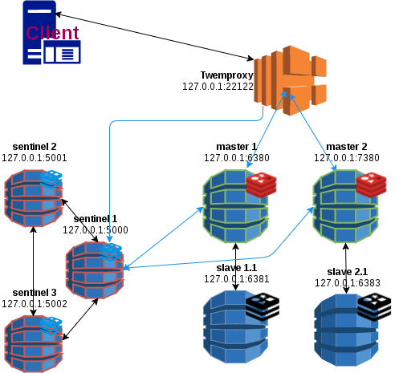

# Sharding with twemproxy
<p align="center">
	<a href="https://redis.io/" target="_blank">
	    
	</a>
</p>

## Installation

## Download the distribution tarball
Download here : [twemproxy releases](https://drive.google.com/open?id=0B6pVMMV5F5dfMUdJV25abllhUWM&authuser=0)

## Build
Make sure you have a well configured developpement environment.
Link  
```shell
apt-get install automake
apt-get install libtool
git clone git://github.com/twitter/twemproxy.git
cd twemproxy
autoreconf -fvi
./configure --enable-debug=log
make
src/nutcracker -h
```

## Run twemproxy nutcracker everywhere 
```shell
sudo cp src/nutcracker /usr/local/bin/
```
## Configuration file 
Create a new file (`dua-redis.yml`) in the conf folder and put this content.
* Here we are using a consistent hashing distribution strategy : ketama
* The two redis servers are listening on port `7777` and `8888`
* The twemproxy server will listen on port  `22122`
```shell
cat > conf/dua-redis.yml <<EOF
beta:
  listen: 127.0.0.1:22122
  hash: fnv1a_64
  hash_tag: "{}"
  distribution: ketama
  auto_eject_hosts: false
  timeout: 400
  redis: true
  servers:
   - 127.0.0.1:7777:1 server1
   - 127.0.0.1:8888:1 server2
   EOF
```

## Run the redis instances 
 
```shell
redis-server --port 7777 --daemonize yes
redis-server --port 8888 --daemonize yes
```

## Start the twemproxy server
 
```shell
nutcracker -c conf/dua-redis.yml
```

## Play with redis using twemproxy
 
```shell
redis-cli -p 22122
127.0.0.1:22122> set katia sana
OK
127.0.0.1:22122> set maturin bado
OK
127.0.0.1:22122> set key value
OK
```


## Check the keys distribution
### On 7777
```shell
redis-cli -p 7777
127.0.0.1:7777> keys *
1) "maturin"
127.0.0.1:7777> get maturin
"bado"
127.0.0.1:7777>
```
### On 8888
```shell
redis-cli -p 8888
127.0.0.1:8888> keys *
1) "key"
2) "katia"
127.0.0.1:8888> get katia
"sana"
127.0.0.1:8888> 
```
